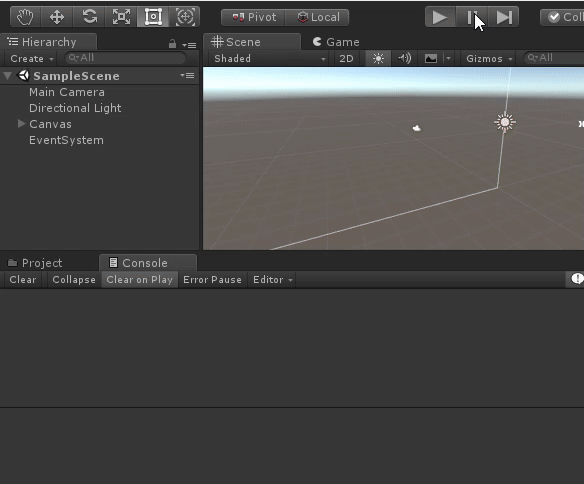

# MonoHooker
本代码的功能是运行时修改C#函数
## 特点：
* 运行时直接修改内存中的 jit 代码，不会修改 UnityEditor.dll 等文件，避免让别人修改文件的尴尬。
* 同时支持 .net 2.x 与 .net 4.x。
* 目前测试支持 unity 2017 与 unity 2018。
* 使用很方便，在C#内定义签名与原始方法相同的两个方法然后注册一下就能用了。

## 预览


## 原理
* MethodInfo.MethodHandle.GetFunctionPointer().ToPointer() 指向了 jit 后的 native 代码，因此修改此地址的代码即可以修改功能。
* 通过一系列跳转就可以巧妙的替换原函数实现，同时也保留调用原函数的功能。
* 本代码的实现与下面 reference 的实现略有不同，比其使用更少的字节，Hook 成功率更高，具体实现可以看代码。

## 使用方法
```CSharp
    [DidReloadScripts] // 最好脚本加载完毕就 hook
    static void InstallHook()
    {
        if(_hooker == null)
        {
            Type type = Type.GetType("UnityEditor.LogEntries,UnityEditor.dll");
            // 找到需要 Hook 的方法
            MethodInfo miTarget = type.GetMethod("Clear", BindingFlags.Static | BindingFlags.Public);

            type = typeof(PinnedLog);

            // 找到被替换成的新方法
            MethodInfo miReplacement = type.GetMethod("NewClearLog", BindingFlags.Static | BindingFlags.NonPublic);

            // 这个方法是用来调用原始方法的
            MethodInfo miProxy = type.GetMethod("ProxyClearLog", BindingFlags.Static | BindingFlags.NonPublic);

            // 创建一个 Hooker 并 Install 就OK啦, 之后无论哪个代码再调用原始方法都会重定向到
            //  我们写的方法ヾ(ﾟ∀ﾟゞ)
            _hooker = new MethodHooker(miTarget, miReplacement, miProxy);
            _hooker.Install();
        }
    }
```

## reference
* https://github.com/bigbaldy1128/DotNetDetour